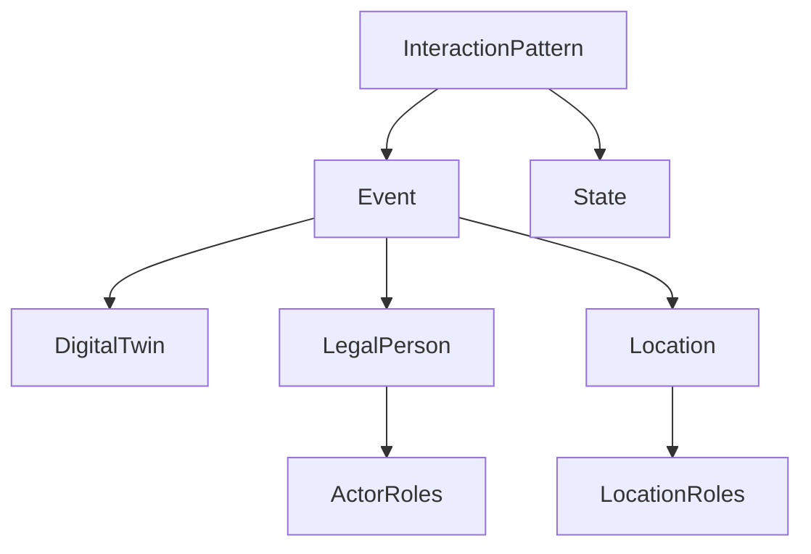

# FEDeRATED Semantic Model

The FEDeRATED Ontology models concepts and relations relevant for reporting logistics data. The ontology models the physical objects, events, locations and their role, actors and their role, and business in the logistics domain. The concept of an event is the core of the model.

## 📁 Project Structure

```md
FEDeRATED-Semantic-Model/
├── 📄 Root Level Files
│   ├── ActorRoles.ttl
│   │   
│   ├── DCAT-Specification.ttl
│   │   
│   ├── DigitalTwin.ttl
│   │   
│   ├── Event.ttl
│   │   
│   ├── LegalPerson.ttl
│   │   
│   ├── Location.ttl
│   │   
│   └── LocationRoles.ttl
│       
│
├── 📂 CodelistsRDF/
│   
│
├── 📂 Orchestration layer/
│   
│
├── 📂 Examples/
│   
│
└── 📂 Mapping Examples/
    
```

## 📋 File Descriptions

### **ActorRoles.ttl**

The actor roles module describes the different types of roles logistics actors can have in the context of an event. The physical actors are described in the separate ontology [LegalPerson](./LegalPerson.ttl). The roles of these actors can differ depending on the event they are involved in. Logistic actors can have commercial, financial or logistic roles.

### **DigitalTwin.ttl**

The digital twin module is a generic ontology modeling physical objects, including also specializations for logistics objects. The main concepts in the Digital Twin ontology module are the following, each containing several subclasses. Additional subclasses can be taken from ontological models produced by the various modalities.

- Equipment
- Package
- Product
- Goods
- Transport Means

Digital twin is an old term, which was coined 20 years ago, surfacing now as our society becomes more interconnected. Several studies refer to a DT as a “cyber-physical integration", with the term “Digital Twin” representing the ultimate, unachievable goal, as no model abstraction can mirror real world things with identical fidelity. For the purposes of this project we created a namespace Digital Twin in which we model the physical component of the logistics domain. The virtual component and the relation between physical and virtual component of DT are out of the the scope of this repository [Reference: https://www.sciencedirect.com/science/article/pii/S0926580519314785].

### **Event.ttl**

The event module describes the logistics activities in the real world, distinguishing between document-mirroring events (such as Purchase Orders, Air Way Bills, House Way Bills, eBill of Lading, etc) and track & trace events (such as ETA, gate-out, border crossing, etc).

 An atomic event always mentions the business identifier (could be AWB/PO/eBoL identifier) it is associated to and the timestamp.

- **Track & trace events** are expressive from their name, they do not require additional properties.
- **Document-mirroring events** on the other hand also require the inclusion of relations between Digital Twins (possibly goods, containers, etc.), Transport Means, Location and Logistic Actors.

For examples of the difference between the 2 event types see the [Adoption repository](https://github.com/federatedplatforms/Semantic-Model-Adoption).

### **LegalPerson.ttl**

The legal person module contains information on the possible means of communication of logistics operators, modelling the contact details dimensions (name, identification, and address)

### **Location.ttl**

The location module contains information on infrastructural and logistical functions that are used in logistics events. The module imports and extends concepts from [Schema.org](http://schema.org).

### **LocationRoles.ttl**

The location roles module contains information about the different types of possible roles a location can have in the context of an event. Location roles refer to the context of the location for the event (i.e., the same port can be the place of loading, for an example outbound vessel while in another event it can be the place of arrival, for an example inbound vessel).

## 📂 Directories

- **CodelistsRDF/** - Collection of RDF codelists and reference data

- **Orchestration layer/** - Orchestration and interaction pattern definitions

- **Examples/** - SPARQL query examples and usage demonstrations

- **Mapping Examples/** - Mapping resources from logistics standardized ontologies to the FEDeRATED semantic model

## Dependency graph


