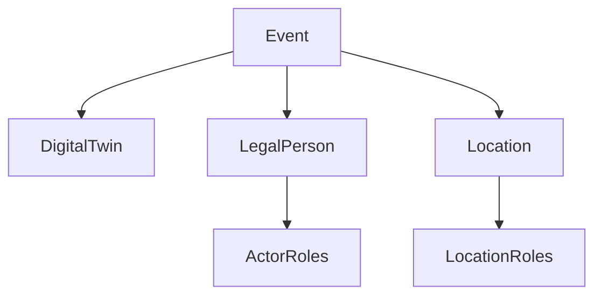

# FEDeRATED Semantic Model

The FEDeRATED Ontology models concepts and relations relevant for reporting logistics data. The ontology models the physical objects, events, locations and their role, actors and their role, and business in the logistics domain. The concept of an event is the core of the model.

## 📁 Project Structure

```md
FEDeRATED-Semantic-Model/
├── 📄 Root Level Files
│   ├── ActorRoles.ttl
│   │   
│   ├── DCAT-Specification.ttl
│   │   
│   ├── DigitalTwin.ttl
│   │   
│   ├── Event.ttl
│   │   
│   ├── LegalPerson.ttl
│   │   
│   ├── Location.ttl
│   │   
│   └── LocationRoles.ttl
│       
│
├── 📂 Examples/
│   
    
```

## 📋 File Descriptions

### **ActorRoles.ttl**

The actor roles module describes the different types of roles logistics actors can have in the context of an event. The physical actors are described in the separate ontology [LegalPerson](./LegalPerson.ttl). The roles of these actors can differ depending on the event they are involved in. Logistic actors can have commercial, financial or logistic roles.

### **DigitalTwin.ttl**

The digital twin module models the physical objects of the logistics domain. Every physical object is a subclass of `LogisticsObject`, the top-level concept, which represents any physical object that can be loaded onto a transport means. It branches into five main concepts:

- **Equipment** — any asset used to facilitate transport and handling of cargo.
- **Goods** — cargo to be carried by a transport means, requiring an equipment.
- **Transport Means** — the vehicles that carry the cargo.
- **Package** — an individual packaged unit.
- **Document** — a legal document involved in event and business transactions.

#### Classification by physical form

Both **Equipment** and **Goods** are classified according to the physical form of the cargo, and the two are kept in sync via the `involvesGoods` property (an equipment is associated with the goods it can hold):

| Physical form | Equipment class | Goods class |
|---|---|---|
| Loose, unpackaged dry solids | `BulkEquipment` | `BulkGoods` |
| Liquids | `LiquidEquipment` | `LiquidGoods` |
| Compressed / liquefied gases | `GasEquipment` | `GaseousGoods` |
| Individually handled solid units | `PiecesEquipment` | `PiecesGoods` |

`Equipment` also directly includes `RailwayWagon`, `Seal`, and `Trailer`.

#### UN Recommendation 21 packaging types

Concrete packaging types are modelled as subclasses of the equipment form-classes above and are aligned to the UN Recommendation 21 packaging codes. A packaging type may belong to more than one form-class (e.g., a `Tank` is at once gas, liquid, and bulk equipment). These include: `Drum`, `Jerrican`, `Bottle`, `Box`, `Crate`, `Bag`, `Basket`, `Tray`, `Can`, `Pail`, `PressureReceptacle`, `Tank`, `Container` (with `ULD` — air-freight Unit Load Devices — as a subclass), `IntermediateBulkContainer`, `CompositePackaging`, `Reel`, `Pallet`, `Bundle`, `Wrapping`, and `Rack`.

#### Transport means

`TransportMeans` covers the vehicles that move cargo across modalities: `Airplane`, `Vessel` (with `Barge` as a subclass), `Truck`, and `Train` (with `Locomotive` as a subclass).

### **Event.ttl**

The event module describes the logistics activities in the real world, distinguishing between document-mirroring events (such as Purchase Orders, Air Way Bills, House Way Bills, eBill of Lading, etc) and track & trace events (such as ETA, gate-out, border crossing, etc).

- **Track & trace events** are expressive from their name, they do not require additional properties.
- **Document-mirroring events** on the other hand also require the inclusion of relations between Digital Twins (possibly goods, containers, etc.), Transport Means, Location and Logistic Actors.

#### Event properties

Every event carries the following properties:

- **UUID** — a unique string identifier for storage and retrieval in a database.
- **involvesBusinessIdentifier** — links the event to a `BusinessIdentifier` object, which contains:
  - `involvesAlphanumericBusinessIdentifier` — the alphanumeric value of the identifier (e.g., AWB number, voyage number IMO0191).
  - `involvesDescriptionBusinessIdentifier` — a human-readable description of what the identifier refers to.
- **involvesTimestamp** — links the event to a `Timestamp` object, which contains:
  - `involvesTimestampDateTime` — the date and time of the event (`xsd:dateTime`).
  - `involvesTimeClassification` — the nature of the timestamp (e.g., planned, estimated, expected, actual, requested).

The following object properties associate an event with other model elements:

| Property | Range | Description |
|---|---|---|
| `involvesCargo` | `DigitalTwin:LogisticsObject` | Cargo involved in the event (goods, empty equipment, or another transport means) |
| `involvesLocation` | `Location:BusinessLocation` | Location associated with the event |
| `involvesActor` | `LegalPerson:Actor` | Logistic actor associated with the event |
| `involvesTransportMeans` | `DigitalTwin:TransportMeans` | Transport means associated with the event |
| `involvesEvent` | `Event` | Reference to another event (used for ETA, ATA, ETD, ATD, etc.) |

### **LegalPerson.ttl**

The legal person module contains information on the possible means of communication of logistics operators, modelling the contact details dimensions (name, identification, and address)

### **Location.ttl**

The location module contains information on infrastructural and logistical functions that are used in logistics events. The module imports and extends concepts from [Schema.org](http://schema.org).

### **LocationRoles.ttl**

The location roles module contains information about the different types of possible roles a location can have in the context of an event. Location roles refer to the context of the location for the event (i.e., the same port can be the place of loading, for an example outbound vessel while in another event it can be the place of arrival, for an example inbound vessel).

## 📂 Directories

- **Examples/** - SPARQL query examples and usage demonstrations

- **Mapping Examples/** - Mapping resources from logistics standardized ontologies to the FEDeRATED semantic model

## Dependency graph


